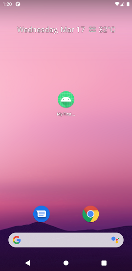
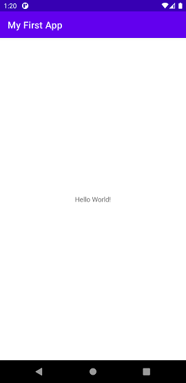
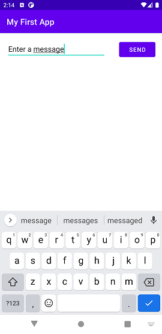
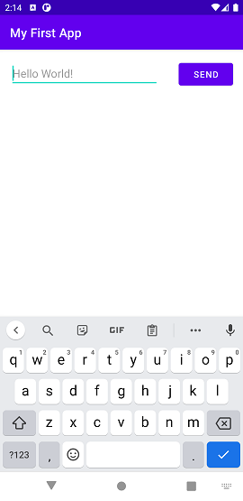
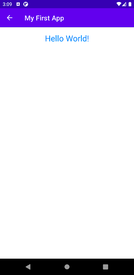

# Tugas1-PPB

Tahapan Pengerjaan:

1. Instalasi Android Studio
2. Pembuatan Project
3. Run App di AVD (Android Virtual Device)
4. Run App di android menggunakan USB Debugging
5. Build Simple User Interface
6. Start Another Activity

Hasil Pengerjaan:

Tampilan AVD

 

User Interface dan Activity

  

